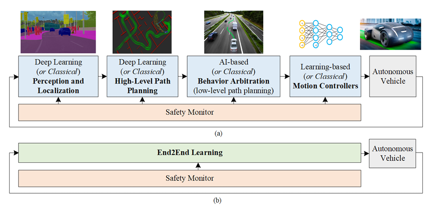

# A Survey of Deep Learning Techniques for Autonomous Driving

## 1. Paper Overview
- **Full Title:** A Survey of Deep Learning Techniques for Autonomous Driving
- **Authors:** Sorin Grigorescu, Bogdan Trasnea, Tiberiu Cocias, Gigel Macesanu
- **Year:** 2020
- **Venue:** IEEE Access
- **Objective of the Survey:** This paper provides a comprehensive review of the state-of-the-art deep learning technologies used in autonomous driving. It investigates both modular perception-planning-action pipelines and End2End learning systems. Additionally, the survey addresses critical implementation factors including functional safety, data sources for training, and specialized computational hardware.

---

## 2. Autonomous Driving System Architecture
The paper defines two primary architectural styles: the **Modular Perception-Planning-Action Pipeline** and **End2End Learning Systems**.

### 2.1 Perception and Localization
*   **Purpose:** To understand the surrounding environment and calculate the vehicle's pose (position and orientation) as it navigates.
*   **Input:** Streams of observations from cameras, radars, LiDARs, ultrasonic sensors, GPS, and inertial sensors.
*   **Output:** 2D/3D object regions of interest, pixel-wise semantic labels, 3D bounding boxes, and 6-DOF vehicle pose.
*   **Deep Learning Methods Used:** CNNs for object detection (YOLO, Faster R-CNN) and segmentation (SegNet, Mask R-CNN); PoseNet and VLocNet++ for End2End visual localization.
*   **Key Challenges:** High cost of LiDAR, lack of depth in monocular cameras, and performance degradation in bad weather or darkness.

### 2.2 High-Level Path Planning
*   **Purpose:** To plan a route through the road network from the current position to the destination.
*   **Deep Learning Involvement:** While standard navigation is often considered "solved," AI is applied to navigating complex road networks and unstructured environments.
*   **Strengths and Limitations:** This module handles the long-term reasoning of the trip, but must provide a reliable route for tactical modules to follow.

### 2.3 Behavior Arbitration (Low-Level Path Planning)
*   **Purpose:** To plan a continuous path and determine future actions based on negotiation skills with other road users (e.g., overtaking, giving way, merging).
*   **Deep Learning Involvement:** Utilizes **Imitation Learning (IL)** to copy human driving behaviors and **Deep Reinforcement Learning (DRL)** to explore driving policies in simulators.
*   **Strengths and Limitations:** **IL** can be trained with data collected from the real-world but is limited by the scarcity of "corner case" data (like crashes); **DRL** explore different driving situations within a simulated world, but faces the **Sim2Real gap** when moved to the real world.

### 2.4 Motion Controllers
*   **Role in AV Stack:** To reactively correct errors generated during the execution of the planned motion by computing longitudinal(acceleration/braking) and lateral (steering) commands.
*   **Learning-Based vs Classical Control:** Classical controllers use fixed parameters, whereas **Learning Controllers** (e.g., Gaussian Process modeling or MPC with CNN cost models) adapt their dynamics models over time based on past vehicle states.
*   **Deployment Considerations:** Must operate at high computation speeds on embedded platforms (like NVIDIA AGX or FPGAs) to ensure short reaction times.

### 2.5 Alternative: End2End Learning Systems
*   **Concept:** A single deep learning architecture that directly maps raw sensory observations (pixels/point clouds) to control outputs.
*   **Advantages:** Simplifies the pipeline by removing the need for manual feature engineering between modules.
*   **Risks and Safety Concerns:** These are "black box" systems that lack explainability, making them difficult to certify under functional safety standards like ISO 26262.

## 3. Deep Learning Method Categories

### 3.1 CNN-Based Perception
- **Core Idea:** Automatically learning hierarchical spatial features from pixel data, mimicking the ventral flux of the mammalian visual cortex.
- **Applications:** Object detection, classification, and pixel-level semantic segmentation.
- **Strengths:** Superior accuracy in 2D/3D feature extraction compared to handcrafted features like HoG or LBP.
- **Weaknesses:** Computationally intensive and requires massive annotated datasets.

### 3.2 Sensor Fusion Approaches
- **Fusion Types:** Combined Camera-LiDAR architectures (MV3D, AVOD) and multi-modal integration (Radar/Camera/LiDAR).
- **Modalities Used:** Video imagery (rich visual info) and LiDAR/Radar (precise depth/range).
- **Challenges:** Synchronizing disparate data frequencies and managing different coordinate systems.

### 3.3 End-to-End Learning
- **Concept:** Direct mapping of raw sensory observations (pixels/point clouds) to control outputs (steering/velocity).
- **Advantages:** Simplifies the pipeline by removing the need for manual feature engineering or intermediate modular steps.
- **Risks and Safety Concerns:** Lacks explainability ("black box" nature) and makes functional safety verification (ISO 26262) extremely difficult.
- **Real-World Limitations:** Vulnerability to "Black Swan" events not present in the training distribution.

### 3.4 Reinforcement Learning for Planning
- **Core Idea:** An agent learns an optimal policy through trial-and-error interactions with an environment to maximize cumulative rewards.
- **Use Cases:** Lane keeping, obstacle avoidance, and aggressive driving maneuvers.
- **Challenges in Real Deployment:** High variance in policy outcomes and the difficulty of defining a reward function that ensures absolute safety.

---
## 4. Safety of Deep Learning in Autonomous Driving
- This section addresses the open debate on using non-deterministic DL in safety-critical systems.
### 4.1 Functional Safety (ISO 26262)
-**Definition:** Safety is the reduction of risk and epistemic uncertainty (lack of knowledge).
- **ASIL Levels:** Automotive Safety Integrity Levels (A to D) define the rigor required for risk reduction; ASIL D is the highest.
- **Gap:** Current standards do not fully accommodate the characteristics of DL-based software.

### 4.2 Failure Modes and Risks
- **Black Swan Events:** Rare, unpredictable scenarios (e.g., white trucks against bright skies).
- **Reward Hacking:** RL agents exploiting sensor or code vulnerabilities to gain rewards without achieving goals safely.
- **Safe Exploration:** Avoiding harmful behaviors during the learning process.
    
### 4.3 Mitigation Strategies
- **Safety Monitors:** Fail-safe mechanisms that stop autonomous control if a failure is detected.
- **HARA:** Hazard Analysis and Risk Assessment to identify goals (e.g., detecting a person at 100m)

---

## 5. Datasets and Evaluation Metrics

### 5.1 Major Datasets Mentioned
- **KITTI:** Benchmarking stereo, optical flow, 3D tracking, and SLAM; 6 hours of rural/highway data.
- **NuScenes:** 1000 scenes with Radar, LiDAR, and Camera data for 3D object detection/tracking.
- **Cityscapes:** Focused on semantic urban street scene understanding with 25,000 annotated images.
- **Oxford RobotCar:** 1000km of driving over 1 year to investigate long-term localization across weather/seasons.
- **Udacity:** 223GB of labeled data for training steering angles via imitation.
- **Daimler/Caltech:** Specialized benchmarks for pedestrian detection, classification, and path prediction.
- **CamVid:** Collection of urban videos providing ground truth semantic labels for 32 object classes at the pixel level, captured via a monocular dashboard camera

### 5.2 Common Evaluation Metrics
- **mAP (mean Average Precision):** Standard for object detection at specific IoU thresholds (mAP50, mAP75).
- **IoU (Intersection over Union):** Used to measure the overlap between predicted and ground truth bounding boxes or segments.
- **Autonomy %:** Percentage of time the neural network drives without human intervention

---

## 6. Computational Hardware and Deployment
Deployment on target edge devices is constrained by price, power, and safety.

### 6.1 Hardware Platforms
- **NVIDIA DRIVE PX/AGX:** AI car computers using Tegra X2, Volta (Xavier), and Pegasus architectures.
- **Renesas R-Car:** V3H (optimized for CNNs and stereo vision) and H3 (compliant with safety standards).

### 6.2 GPU vs. FPGA
- **Performance:** FPGAs offer reduced latency and eliminate memory bottlenecks via chip cache.
- **Efficiency:** FPGAs can consume up to 10 times less power than GPUs for similar algorithms.
- **Functional Safety:** Unlike GPUs, FPGAs are designed to meet rigorous automotive safety requirements

## 7. Key Challenges Identified in the Survey
- **Technical Limitations:** Bridging the gap between low-cost camera 3D estimation and high-cost LiDAR accuracy.
- **Generalization Issues:** Difficulty in handling "Black Swan" events and rare corner cases underrepresented in training data.
- **Safety Concerns:** Non-deterministic nature of DL software conflicts with standard functional safety (ISO 26262).
- **Data-Related Problems:** Managing petabytes of daily data and the "hunger" for massive, diverse annotated sets.
- **Real-Time Constraints:** Processing high-bandwidth sensor streams on energy-efficient embedded edge devices.

---

## 8. Research Gaps and Future Directions
- **Explainability:** Developing methods to interpret and prove the safety of neural network decision-making.
- **Sim2Real Transfer:** Reducing the bias when porting Reinforcement Learning models from simulators to the physical world.
- **Few-Shot Learning:** Designing one-shot or low-shot learning methods to master hazardous corner cases with minimal data.
- **Hybrid Control:** Better integration of classical model-based control (stability) with deep learning (optimization/identification).
- **Standardization:** Creating new safety standards specifically targeted for data-driven, machine learning automotive software.

---

## 9. Personal Research Reflection

### Which module interests me most and why?

I am particularly interested in the perception module of the autonomous driving stack. Perception serves as the foundation for all downstream tasks such as prediction and planning. Any failure at this stage propagates through the system, directly impacting safety and reliability. 

Given my background in automobile engineering, I am especially drawn to perception because it connects physical vehicle behavior with environmental understanding. Accurate scene understanding is critical for real-world deployment, particularly in complex and dynamic traffic environments.

---

### Which limitation appears most promising for research?

From the survey, one significant limitation is the lack of robustness and generalization in perception models under varying environmental conditions such as weather changes, lighting variations, and occlusions. Many approaches achieve strong performance on benchmark datasets but struggle in edge cases and real-world deployment scenarios.

Improving robustness, domain adaptation, and data-efficient learning in perception systems appears to be a promising research direction.

---

### What experiment could I build based on this survey?

I have previously implemented semantic image segmentation using the CamVid dataset. Building on that experience, I plan to:

- Evaluate segmentation model performance under simulated weather and lighting perturbations.
- Analyze class-wise IoU degradation in challenging scenarios.
- Explore lightweight architectures suitable for real-time deployment.

This would allow me to connect theoretical survey insights with practical experimentation.

---

### How does this align with my PhD goals?

My long-term goal is to pursue a PhD focused on developing reliable and robust perception systems for autonomous vehicles. By strengthening my understanding of deep learning-based perception and addressing its limitations, I aim to contribute to safer and more deployable autonomous driving systems.
